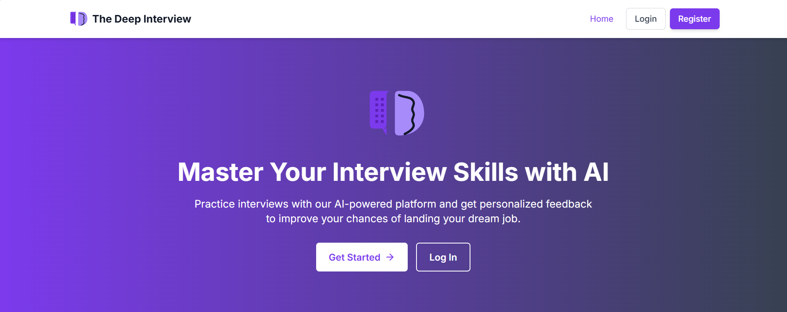

# The Deep Interview

[](https://github.com/yourusername/the-deep-interview)
[](https://github.com/yourusername/the-deep-interview)
[](https://github.com/yourusername/the-deep-interview)
[](https://github.com/yourusername/the-deep-interview)
[](https://github.com/yourusername/the-deep-interview)

A comprehensive AI-powered interview simulator with voice interaction.

## 📋 Overview

The Deep Interview is an interactive platform that helps users prepare for job interviews through AI-powered simulations. The application leverages OpenAI's GPT-4 to generate interview questions, evaluate responses, and provide feedback based on the user's resume and job position.

## 🔧 Tech Stack

- **Frontend**: React.js with Tailwind CSS
- **Backend**: Node.js with Express
- **Database**: MongoDB
- **Real-time Communication**: Socket.io
- **AI Integration**: OpenAI API (GPT-4)
- **Authentication**: JWT

## ✅ Features

- User authentication and profile management
- Resume upload and analysis
- AI-generated interview questions based on job position and skill level
- Real-time interview simulations
- Comprehensive feedback on interview performance
- Multiple interview types (technical, behavioral)

## 🚀 Getting Started

### Prerequisites

- Node.js (v14 or higher)
- MongoDB (local or Atlas)
- OpenAI API key

### Installation

1. Clone the repository:

   ```bash
   git clone https://github.com/deepakbalusupati/The-Deep-Interview.git
   cd The-Deep-Interview
   ```

2. Install all dependencies (server and client):

   ```bash
   npm run install-all
   ```

3. Create a `.env` file in the root directory with the following variables:
   ```
   PORT=5001
   NODE_ENV=development
   MONGO_URI=mongodb://localhost:27017/deepinterview
   CLIENT_URL=http://localhost:3000
   OPENAI_API_KEY=your_openai_api_key_here
   JWT_SECRET=your_jwt_secret_here
   ```

### Running the Application

1. Start the development server (runs both backend and frontend):

   ```bash
   npm run dev
   ```

2. The application will be available at:
   - Frontend: `http://localhost:3000`
   - Backend API: `http://localhost:5001`

### Production Build

To create a production build:

```bash
npm run build
```

To start the production server:

```bash
npm start
```

## 📂 Complete Project Structure

```
the-deep-interview/
├── client/                 # React frontend
│   ├── public/             # Public assets
│   │   ├── index.html      # HTML entry point
│   │   ├── favicon.ico     # Favicon
│   │   ├── logo.svg        # Logo SVG
│   │   ├── logo192.png     # Logo (192px)
│   │   ├── logo512.png     # Logo (512px)
│   │   └── manifest.json   # Web app manifest
│   ├── src/                # Source files
│   │   ├── assets/         # Static assets
│   │   ├── components/     # Reusable components
│   │   │   ├── common/     # Common components
│   │   │   │   ├── LogoSpinner.js
│   │   │   │   └── PrivateRoute.js
│   │   │   ├── layout/     # Layout components
│   │   │   │   ├── Footer.js
│   │   │   │   └── Header.js
│   │   │   └── ui/         # UI components
│   │   │       ├── Button.js
│   │   │       └── Spinner.js
│   │   ├── context/        # React context providers
│   │   ├── hooks/          # Custom React hooks
│   │   ├── pages/          # Page components
│   │   │   ├── Dashboard.jsx
│   │   │   ├── Home.js
│   │   │   ├── InterviewResults.jsx
│   │   │   ├── InterviewSession.jsx
│   │   │   ├── InterviewSetup.jsx
│   │   │   ├── Login.jsx
│   │   │   ├── NotFound.jsx
│   │   │   ├── Profile.jsx
│   │   │   ├── Register.jsx
│   │   │   └── ResumeManager.jsx
│   │   ├── styles/         # CSS/SCSS files
│   │   ├── utils/          # Utility functions
│   │   ├── App.js          # Main React component
│   │   └── index.js        # React entry point
│   ├── tailwind.config.js  # Tailwind CSS config
│   ├── postcss.config.js   # PostCSS config
│   └── package.json        # Frontend dependencies
├── server/                 # Express backend
│   ├── controllers/        # Route controllers
│   │   ├── interviewController.js
│   │   ├── resumeController.js
│   │   └── userController.js
│   ├── routes/             # API routes
│   │   ├── api/            # API-specific routes
│   │   │   └── health.js   # Health check endpoints
│   │   ├── interview.js    # Interview routes
│   │   ├── resume.js       # Resume routes
│   │   └── user.js         # User routes
│   ├── utils/              # Utility functions
│   │   └── openaiService.js # OpenAI integration
│   └── index.js            # Server entry point
├── models/                 # MongoDB models
│   ├── InterviewSession.js # Interview session model
│   ├── Resume.js           # Resume model
│   └── User.js             # User model
├── uploads/                # User uploaded files
├── The_Deep_Interview.png  # Project screenshot
├── package.json            # Project dependencies
└── .gitignore              # Git ignore file
```

## 🔐 Authentication

The application uses JWT (JSON Web Tokens) for authentication. Users can:

- Register a new account
- Log in with email and password
- Access protected routes with valid tokens

## 📄 API Endpoints

### User Routes

- `POST /api/user/register` - Register a new user
- `POST /api/user/login` - User login
- `GET /api/user/profile` - Get user profile

### Resume Routes

- `POST /api/resume/upload` - Upload a new resume
- `GET /api/resume` - Get all resumes for a user
- `GET /api/resume/:resumeId` - Get a specific resume
- `DELETE /api/resume/:resumeId` - Delete a resume
- `PUT /api/resume/:resumeId/default` - Set a resume as default
- `POST /api/resume/analyze` - Analyze a resume

### Interview Routes

- `POST /api/interview/create` - Create a new interview session
- `GET /api/interview/:sessionId` - Get interview session details
- `POST /api/interview/:sessionId/questions` - Generate interview questions
- `POST /api/interview/:sessionId/evaluate` - Evaluate interview response

### Health Routes

- `GET /api/health` - Basic health check
- `GET /api/health/details` - Detailed health check with environment info

## 🧠 AI Integration

The application integrates with OpenAI's GPT-4 model to:

1. Generate relevant interview questions based on job position and skill level
2. Evaluate candidate responses against expected topics
3. Analyze resumes and identify strengths/weaknesses
4. Provide comprehensive interview feedback

In development mode, mock responses are provided if no OpenAI API key is configured.

## 📱 Cross-Platform Compatibility

The Deep Interview is designed to work seamlessly on both Windows and Linux environments. The application uses:

- Path normalization for file operations
- Environment variables for configuration
- Cross-platform compatible dependencies

## 🔍 Future Improvements

While not implemented yet, future versions could include:

- Voice recognition for spoken responses
- Video recording of interview sessions
- Integration with job boards
- Mock interview with AI avatars

## 📄 License

This project is licensed under the MIT License.
